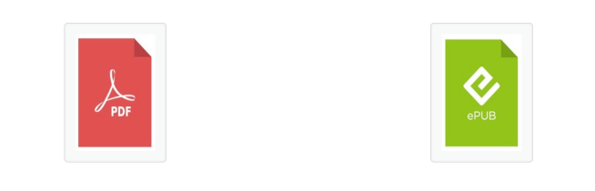

# Summary

We want to create a bot which can download epub and PDFs (books) from https://oceanofpdf.com/. However it should be possible for the user to select which book should be downloaded. For that a simple TUI interface should be created. To prevent duplicate processing and downloading the processed (downloaded or not downloaded) books shall be recorded.

# Technical Design

Python 3 shall be used as the implementation language. Virtual environment (venv) of Python 3 shall be used. For logging loguru (https://github.com/delgan/loguru) should be used. For the TUI rich (https://github.com/Textualize/rich) could be used. For the database SQLite must be used. Leverage pytest (https://docs.pytest.org/) for testing.

# Further details and notes

* The start URL is https://oceanofpdf.com/recently-added/. Paging is at the button. Please let the user choose how many pages at maximum shall be processed. Next page can be opened via https://oceanofpdf.com/recently-added/page/<page number>, e.g. https://oceanofpdf.com/recently-added/page/2, and so on.
* Relevant entries can be identified via `<header class="entry-header">`. Please list the title of the book. The language follows directly after: `<strong>Language: </strong>`. And also the genre, it follow directly after: `<strong>Genre: </strong>`.
* Each book on the page shall be processed.
* Because of the way the page is implemented we probably need to automate a real browser. WebDriver comes to mind for doing that but also Puppeteer could be used. (Puppeteer would limit us regarding browser. So, maybe if possible wrap the usage.) Be sure to allow the user to set some kind of pause (default: 2 seconds) between requests to not overload the server! We are good citizens. You can leverage puppeteer to be able to understand the web pages better. Downloads should be non-concurrent for now.
* Implement a dummy filter function because later on we will automatically filter books on some criterias like name of the book, language and genre.
* The application should always tell the user what it is doing.
* Download directory should be configurable. But please use a sane default, like ~/Downloads under mac OS. Use the server-provided filename. But add a method which would allow renaming of those downloaded files (we will strip the prefix "\_OceanofPDF.com\_", careful those are real underscores and italic, that's the reaons for the backslashes there).
* Application should be single flow (scrape → select → download). But it should be possible to abort it anytime. After restart currently not downloaded (but marked for download) books shall be downloaded. And the user can process any non-processed books (those are books which are currently 'new').
* Let the user choose if the browser is visible or runs headless. Default should be visible (for now).

# Examples

## List of books

```
<header class="entry-header"><a class="entry-image-link" href="https://oceanofpdf.com/authors/margaret-l-lial/pdf-college-algebra-and-trigonometry-by-margaret-l-lial-download/" aria-hidden="true" tabindex="-1"><noscript></noscript></a><h2 class="entry-title"><a class="entry-title-link" rel="bookmark" href="https://oceanofpdf.com/authors/margaret-l-lial/pdf-college-algebra-and-trigonometry-by-margaret-l-lial-download/">College Algebra and Trigonometry by Margaret L. Lial</a></h2><p class="entry-meta"><time class="entry-time">February 16, 2026</time></p></header>

```

* The relevant link for the detail page is in the `a` HTML tag, https://oceanofpdf.com/authors/margaret-l-lial/pdf-college-algebra-and-trigonometry-by-margaret-l-lial-download/
* See also 


## Detail page

```
<form style="float: left; width: 50%;" action="https://oceanofpdf.com/Fetching_Resource.php" method="post" target="_blank"><input name="id" type="hidden" value="srv3"><input name="filename" type="hidden" value="Sweet_Temptation_-_Cora_Kent.pdf"><p></p><div align="center"><input style="width: 141px; height: 192px;" alt="Submit" src="https://media.oceanofpdf.com/pdf-button.jpg" type="image"></div></form>
```

For the download itself one or two HTML `form` are used. One for PDF and one for the epub version. (Both version shall be download.) Please mind that the form needs to be submitted to be able to download the file because the final URL is dynamically generated on the server side.

See also 

# Plan

## Step 1 (requirements)

Please analyse the above requirements. If you think something is missing, please let me know.

## Step 2 (scrapping)

Let's implement a simple prototype which lists all books with the details (title of the book, URL to the detail page, language and genre) until a given page. However it's possible that genre and language are not there. Just assume "unknown" then.

## Step 3 (persistence)

Import that information into the database. A simple table should do with at least following columns: title of the book, URL to detail page, language, genre, flag for state (new, skipped, scheduled for download, done (= downloaded), retry (= download failed), and so on), timestamp.

## Step 4 (user interaction)

Allow the user to select which book to download. Mark those to scheduled for download in the database. Also how many pages to process, etc.

## Step 5 (opening of detail page)

Implement opening of detail page.

## Step 6 (downloading)

Implement execution of download on detail page. (Need to "click" the buttons on that page.)


